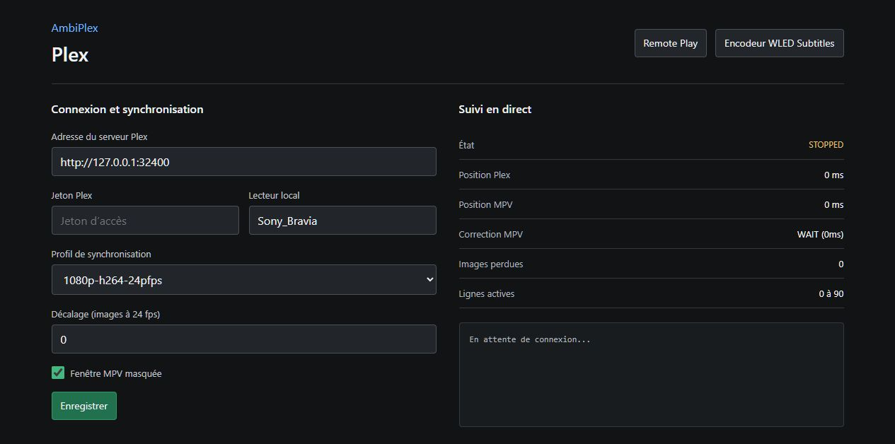
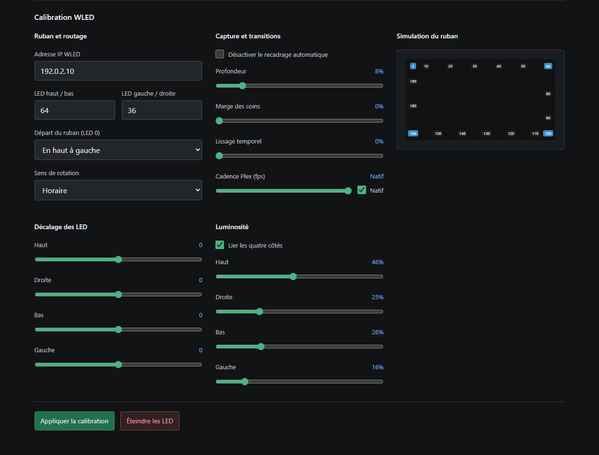
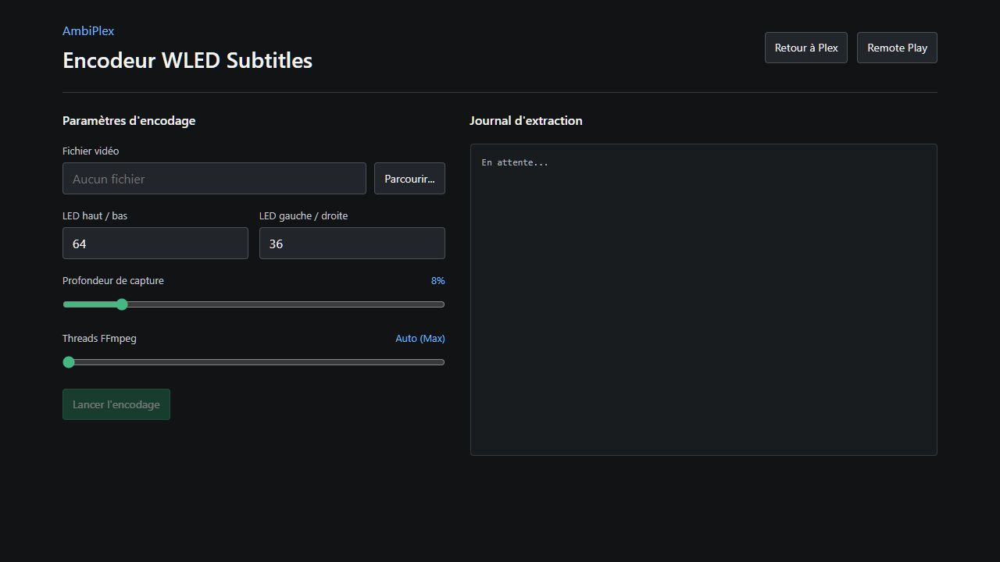
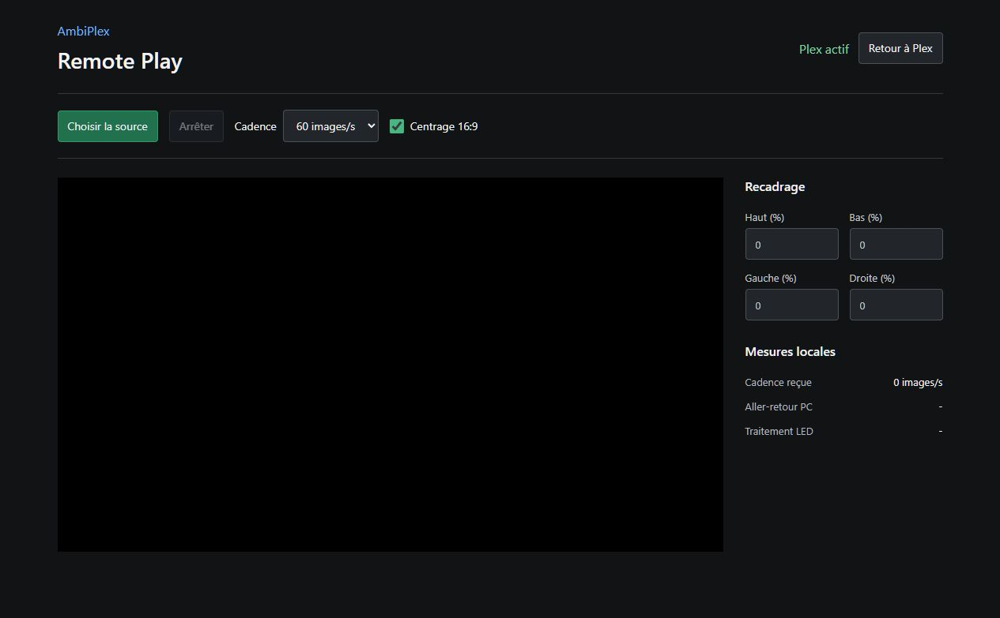

# AmbiPlex

Un système Ambilight ultra-performant et 100% logiciel conçu pour se synchroniser avec le lecteur vidéo **Plex** et piloter un ruban LED matériel (via **WLED / QuinLED ESP32**) sur un réseau local.

## ✨ Fonctionnalités
- **Man-in-the-Middle Plex** : Écoute les évènements de lecture de Plex via Websocket et synchronise une instance invisible (headless) de `MPV` en arrière-plan.
- **Auto-Crop Asymétrique (Anti-Sous-titres)** : Détecte mathématiquement les bandes noires (Letterbox 2.35:1) en temps réel. Analyse uniquement la bande supérieure pour ignorer les sous-titres, garantissant une stabilité visuelle absolue.
- **Downscaling Extrême (Fallback)** : Utilise l'API `screenshot_raw` de `libmpv` et `Pillow` pour réduire l'image en temps réel avant extraction si le format l'exige.
- **Mode Zéro CPU (WLED Subtitles)** : Décompresse "à la volée" (`lz4`) des fichiers `.wledsub.lz4` pré-calculés, cartographie la mémoire (`numpy.memmap`) et court-circuite complètement le lecteur vidéo. Baisse drastiquement la consommation CPU.
- **Moteur LED Numpy** : Calcule la moyenne des couleurs (RGB) des bordures de l'image en quelques millisecondes via *slicing* matriciel.
- **Protocole DDP (UDP)** : Transmet les données à WLED via le protocole *Distributed Display Protocol* à plus de 20 FPS pour une latence nulle.
- **Interface Web Moderne** : Configuration en temps réel (FastAPI + Vanilla JS Glassmorphism) avec simulateur LED interactif.

## ⚙️ Prérequis Matériels
- Un serveur Plex et un client Plex local (ex: Apple TV, Nvidia Shield, Smart TV).
- Un contrôleur LED sous WLED (Recommandé : **QuinLED Dig-Uno** avec Ethernet Hat).
- Un ruban LED adressable (ex: **WS2812B** 60 leds/m).

## 🚀 Installation
1. Clonez ce dépôt.
2. Créez un environnement virtuel Python (`python -m venv venv`).
3. Installez les dépendances (`pip install -r requirements.txt` si disponible, ou installez manuellement `fastapi`, `uvicorn`, `plexapi`, `numpy`, `Pillow`, `python-mpv`).
4. Téléchargez la librairie dynamique `libmpv-2.dll` et placez-la à la racine du projet (Windows).
5. Lancez le serveur via le fichier **`start.bat`**.

## 🔧 Utilisation
1. Ouvrez l'interface web (par défaut : `http://127.0.0.1:5777`).
2. Saisissez vos identifiants Plex (URL et Token) et le nom de votre client Plex.
3. Saisissez l'adresse IP de votre contrôleur WLED.
4. Ajustez le nombre de LEDs pour chaque bordure (Haut, Bas, Gauche, Droite).
5. Lancez un film sur Plex : les couleurs s'afficheront instantanément dans le simulateur web et sur votre mur !

## 🎬 Mode Zéro CPU (WLED Subtitles)
Pour les plateformes légères (Raspberry Pi, vieux PC), vous pouvez pré-générer les couleurs d'un film pour supprimer toute charge CPU pendant la lecture :
1. Utilisez l'outil intégré : `python bake.py "Chemin\Vers\Le\Film.mkv" --leds-x 64 --leds-y 36`
2. Un fichier ultra-léger `.wledsub.lz4` sera créé à côté de la vidéo.
3. À la prochaine lecture, AmbiPlex basculera automatiquement en mode Zéro CPU !

## 🛡️ Sécurité & Confidentialité
Aucun secret (Token Plex, IP locale) n'est stocké dans le code source. Toutes les données sensibles sont sauvegardées dans un fichier `config.json` local (qui est ignoré par Git).

## 📸 Galerie

---
*Conçu par Sébastien Bédard*
